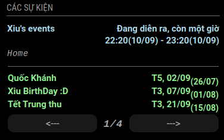

## MODULE: VietNamEventsCalendar


- This module will display your personal google calendar and VietNam events or your events
- We can edit VietNam events in VietNamCal.js

## DEFAULT CONFIG:
To use this module, add below config into the modules array in the `config/config.js` file.

```js
{
    module: "MMM-VietNamEventsCalendar",
    position: "top_left",
    config: {
        maximumEntries: 10,
        lunarColor: "LightGreen",
        calendars: [
	{
            url: "https://calendar.google.com/calendar/ical/anhquantong77%40gmail.com/public/basic.ics",
            color: "Violet",
            name: "Google lịch của anhquantong77 nha"
        }, 
	{
            url: "https://calendar.google.com/calendar/ical/quan.ng0anhin98%40gmail.com/public/basic.ics",
            color: "PowderBlue",
            name: "Google lịch của quan.ng0anhin98 nè"
        }],
        personalDateEvent:[
        {
            day: 7,
            month: 7,
            title: "Xiu BirthDay :D"
        }]
    }
}
```
## CONFIGURATION OPTIONS

| Option | Type | Possible Values | Default Value | Description |
| --- | --- | --- | --- | --- |
| `maximumEntries`           | `int` | `0` - `100`        | `10`                     | The maximum number of events, affect both (Google,VNevents). |
| `maximumNumberOfDays`      | `int` | `365`, `366`       | `365`                    | The maximum number of days in the future. |
| `maxTitleLength`           | `int` | `10` - `50`        | `20`                     | The maximum title length. |
| `maxTitleLines`            | `int` | `0` - `10`         | `3`                      | The maximum number of lines a title will wrap vertically before being cut (Only enabled if `wrapEvents` is also enabled). |
| `wrapEvents`               | `bool` | `true`, `false`    | `true`                   | Wrap event titles to multiple lines. Breaks lines at the length defined by `maxTitleLength`. |
| `fetchInterval`      | `int`  | `1000` - `86400000`     | `60000` (1')             | How often does the content needs to be fetched? (Milliseconds). |
| `animationSpeed`     | `int`  | `0` - `5000`            | `500` (0.5s)             | Speed of the update animation. (Milliseconds). |
| `tableClass`         | `String` | `xsmall`, `small`, `medium`, `large`, `xlarge`   | `xsmall` | Name of the classes from `main.css`. |
| `displayPageIndicator`   | `bool` | `true`, `false`    | `true`                  | Display page indicator to inform user which page they are standing (current page / last page). |
| `displaySwitchBtn`   | `bool` | `true`, `false`    | `true`                  | Display button to switch calendars (pre/next). |
| `displayCalendarAfterInterval`  | `bool` | `true`, `false`    | `true`       | Allow display to a page after `fetchInterval`. |
| `calendarAfterInterval`         | `int` | `0` - (google calendar quantity + 2) | `0` (All calendars) | Display at page after `fetchInterval`. |
| `displayEndTime`     | `bool` | `true`, `false`    | `true`                  | Allow display end time of google calender events. |
| `dateEndFormat`      | `String`  |See [Moment.js](https://momentjs.com/docs/#/parsing/string-format/) | `"LT(DD/MM)"`  | Format to use for the date of events when using absolute dates. (version <= 2.16.0) From version 2.16.0, this option will be used to format absolute and relative dates. (e.g. DD/MM/YY to change from the default MM/DD/YYYY). |
| `colored`            | `bool` | `true`, `false`    | `true`                    | Allow color google calendar events. |
| `defaultColor`       | `String` | HEX, RGB or RGBA values (#efefef, rgb(242,242,242), rgba(242,242,242,0.5)) | `"White"`                   | Default color of Google Calendar events. |
| `showLocation`       | `bool` | `true`, `false`    | `true`                    | Allow show location of google calendar events. |
| `lunarColor`         | `String` | HEX, RGB or RGBA values (#efefef, rgb(242,242,242), rgba(242,242,242,0.5)) | `"LightGreen"`                     | Color of VietNam, Personal events. |
| `displayLunarEvents`    | `bool` | `true`, `false`    | `true`                     | Display VietNam, Personal events. |
| `displayLunarDate`      | `bool` | `true`, `false`    | `true`                     | Display VietNam, Personal lunar time. |
| `displayPersonalEvents` | `bool` | `true`, `false`    | `true`                     | Display Personal events. |

## CALENDARS OPTIONS
| Option | Type | Possible Values | Default Value | Description |
| --- | --- | --- | --- | --- |
| `calendars` | `[]` | See `calendar` configuration below     | An example calendar                  | The list of calendars. |
| `url`   | `String` | See `url` configuration below       | Any public accessible .ical calendar    | The url of the calendar `.ical`. This property is required. |
| `color` | `String` | HEX, RGB or RGBA values (#efefef, rgb(242,242,242), rgba(242,242,242,0.5))    | `"Violet"`                     | Color of Google Calendar events. |
| `title` | `String` | Custom google calendar name         | Your calendar name                      | You can put your calendar name. |

## PERSONAL DATE EVENT OPTIONS
| Option | Type | Possible Values | Default Value | Description |
| --- | --- | --- | --- | --- |
| `personalDateEvent`| `[]`   | See `personalDateEvent` configuration below    | An example calendar          | The list of personalDateEvent. |
| `day`   | `int`,`String`    | `1-31`              | Your event date          | Your event date. |
| `month` | `int`,`String`    | `1-12`              | Your event month         | Your event month. |
| `title` | `String`          | Your event name     | Your event name          | You can put your event name. |

## NOTIFICATIONS

The following is the list of notifications that MMM-pages will handle:

| Notification | Payload type | Description |
| --- | --- | --- |
| `PREVIOUS_CALENDAR`      | *None* | Switch to next calendar. |
| `NEXT_CALENDAR`          | *None* | Switch to previous calendar. |
| `SWITCH_TO_ALL_CALENDAR` | *None* | Switch to page which include all calendars. |

## EVENTS:
1. Tết Dương lịch
2. Ngày Sinh viên Học sinh VN
3. Tết ông Công ông Táo
4. Mùng 1 Tết Nguyên Đán
5. Mùng 2 Tết Nguyên Đán
6. Mùng 3 Tết Nguyên Đán
7. Ngày thành lập ĐCSVN
8. Tết Nguyên Tiêu
9. Ngày Lễ tình nhân Valentine
10. Ngày Thầy thuốc VN
11. Quốc tế Phụ Nữ
12. Quốc tế Hạnh phúc
13. Ngày thành lập ĐTNCS HCM
14. Tết Hàn thực
15. Ngày Thể thao VN
16. Ngày Cá tháng Tư
17. Giỗ tổ Hùng Vương
18. Lễ Phục Sinh
19. Ngày Sách VN
20. Ngày Trái đất
21. Ngày thống nhất đất nước
22. Quốc tế Lao Động
23. Ngày chiến thắng ĐBP
24. Lễ Phật Đản
25. Ngày của Mẹ
26. Quốc tế Gia đình
27. Ngày thành lập ĐTNTP HCM
28. Ngày sinh Chủ tịch HCM
29. Quốc tế Thiếu Nhi
30. Ngày Môi trường Thế Giới
31. Ngày BH ra đi tìm đường cứu nước
32. Ngày của Cha
33. Tết Đoan Ngọ
34. Ngày Gia đình VN
35. Ngày Dân số Thế Giới
36. Ngày Thương binh liệt sĩ
37. Ngày CMT8 thành công
38. Quốc Khánh
39. Lễ Vu Lan
40. Quốc tế Người cao tuổi
41. Tết Trung thu
42. Ngày Doanh nhân VN
43. Ngày thành lập Hội Phụ nữ VN
44. Halloween Lễ hội hoá trang
45. Quốc tế Nam giới
46. Ngày Nhà giáo VN
47. Lễ tạ ơn
48. Black Friday
49. Quốc tế phòng chống AIDS
50. Quốc tế người khuyết tật
51. Quốc tế nhân quyền
52. Ngày thành lập QĐND VN
53. Noel Lễ Giáng Sinh


